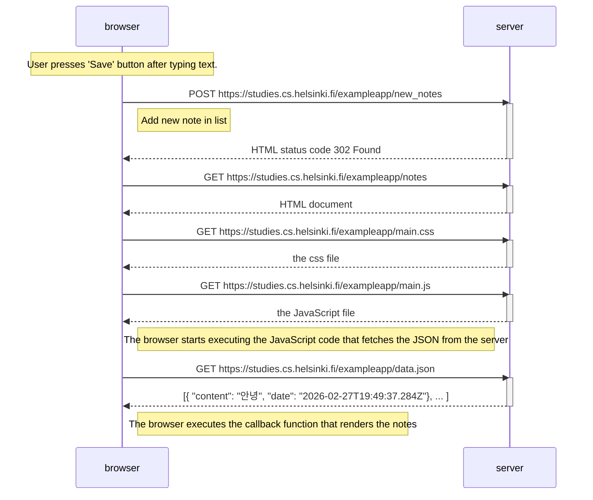

```mermaid
sequenceDiagram
    participant browser
    participant server

    Note over browser: User presses 'Save' button after typing text.

    browser->>server: POST https://studies.cs.helsinki.fi/exampleapp/new_notes
    activate server
    Note right of browser: Add new note in list
    server-->>browser: HTML status code 302 Found
    deactivate server

    browser->>server: GET https://studies.cs.helsinki.fi/exampleapp/notes
    activate server
    server-->>browser: HTML document
    deactivate server

    browser->>server: GET https://studies.cs.helsinki.fi/exampleapp/main.css
    activate server
    server-->>browser: the css file
    deactivate server

    browser->>server: GET https://studies.cs.helsinki.fi/exampleapp/main.js
    activate server
    server-->>browser: the JavaScript file
    deactivate server

    Note right of browser: The browser starts executing the JavaScript code that fetches the JSON from the server

    browser->>server: GET https://studies.cs.helsinki.fi/exampleapp/data.json
    activate server
    server-->>browser: [{ "content": "안녕", "date": "2026-02-27T19:49:37.284Z"}, ... ]
    deactivate server

    Note right of browser: The browser executes the callback function that renders the notes
```