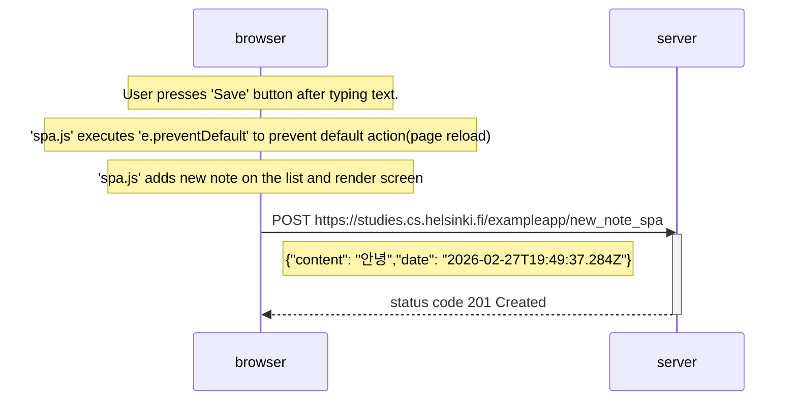

```mermaid
sequenceDiagram
    participant browser
    participant server

    Note over browser: User presses 'Save' button after typing text.

    Note over browser: 'spa.js' executes 'e.preventDefault' to prevent default action(page reload)
    Note over browser: 'spa.js' adds new note on the list and render screen

    browser->>server: POST https://studies.cs.helsinki.fi/exampleapp/new_note_spa
    activate server
    Note right of browser: {"content": "안녕","date": "2026-02-27T19:49:37.284Z"}
    server-->>browser: status code 201 Created
    deactivate server
```